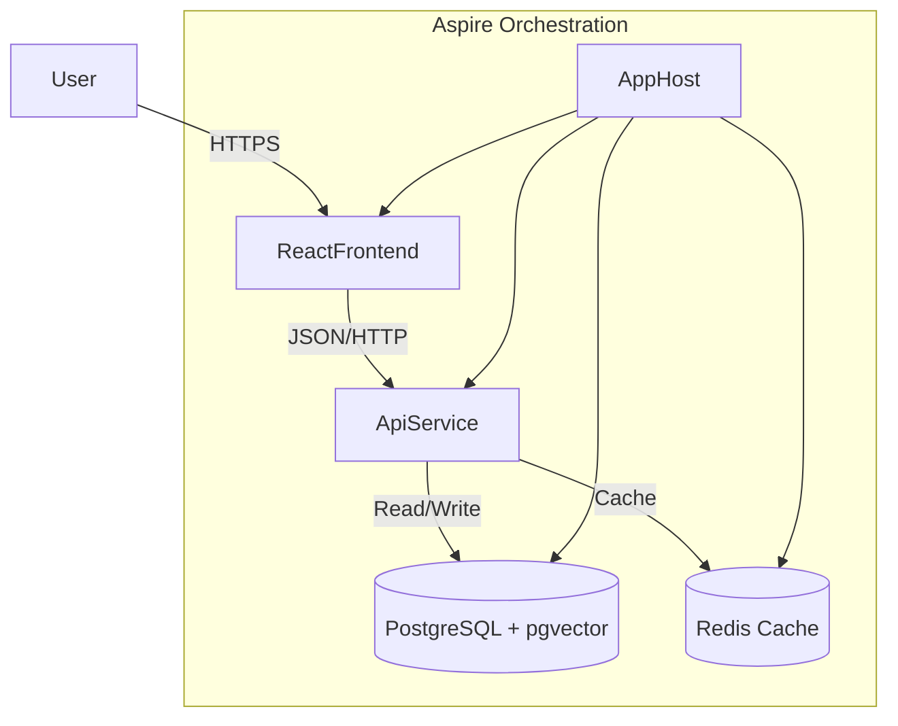

# Property Pulse

[](https://github.com/junaid109/Property-Pulse)
[](LICENSE)
[](https://dotnet.microsoft.com/download)
[](https://learn.microsoft.com/en-us/dotnet/aspire/)

**Property Pulse** is a high-performance, modern real estate/property viewing platform built on the bleeding edge of the .NET ecosystem. It serves as a reference implementation for constructing cloud-native, distributed applications using .NET Aspire, EF Core with Vector Search, and a high-interactivity React frontend.

## 🚀 Key Features

*   **Cloud-Native Orchestration**: Built with [.NET Aspire](https://learn.microsoft.com/en-us/dotnet/aspire/) for seamless local development and deployment.
*   **Semantic Search**: Utilizes **PostgreSQL pgvector** and **Entity Framework Core 10** for natural language property discovery (e.g., "modern apartment near downtown").
*   **High Performance**: Backend API optimized with **Native AOT** and **HybridCache**.
*   **Modern Frontend**: Interactive UI built with **React 19**, **Vite**, and **Tailwind CSS v4**.
*   **Real-time Interactions**: Live viewing counters and updates via SignalR.

## 📂 Repository Structure

The solution follows a clean architecture pattern structured for distributed systems:

| Project | Description |
| :--- | :--- |
| **PropertyPulse.AppHost** | The .NET Aspire orchestrator project that manages local resources (Postgres, Redis, Frontend). |
| **PropertyPulse.ApiService** | ASP.NET Core Web API (Minimal APIs) handling data access, search logic, and business rules. |
| **PropertyPulse.WebFrontend** | React 19 + Vite application providing the user interface. |
| **PropertyPulse.ServiceDefaults** | Shared configuration for OpenTelemetry, health checks, and service discovery resilience. |

## 🛠️ Prerequisites

*   [.NET 10 SDK (Preview)](https://dotnet.microsoft.com/download/dotnet/10.0)
*   [Docker Desktop](https://www.docker.com/products/docker-desktop) (required for PostgreSQL and Redis containers)
*   [Node.js](https://nodejs.org/) (v20+)
*   [PowerShell](https://learn.microsoft.com/en-us/powershell/scripting/install/installing-powershell) (optional, for scripts)

## 🏁 Getting Started

1.  **Clone the repository**:
    ```bash
    git clone https://github.com/junaid109/Property-Pulse.git
    cd Property-Pulse
    ```

2.  **Trust the development certificate** (if not already done):
    ```bash
    dotnet dev-certs https --trust
    ```

3.  **Run the application**:
    Navigate to the root directory and run the Aspire AppHost:
    ```bash
    cd PropertyPulse
    dotnet run --project PropertyPulse.AppHost/PropertyPulse.AppHost.csproj
    ```
    *Alternatively, open the solution in Visual Studio 2022 and set `PropertyPulse.AppHost` as the startup project.*

4.  **Explore the Dashboard**:
    The Aspire Dashboard will launch automatically. From here, you can view logs, traces, and metrics for all services. Click on the `webfrontend` endpoint to access the UI.

## 📐 Architecture



## 🤝 Contributing

We welcome contributions! Please see our [Contribution Guidelines](CONTRIBUTING.md) for details on how to submit pull requests, report issues, and specific coding standards.

## 📄 License

This project is licensed under the MIT License - see the [LICENSE](LICENSE) file for details.
